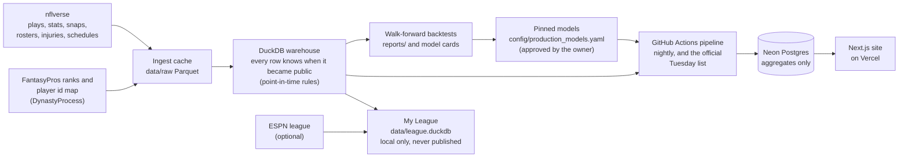

# Two-Minute Warning

**Two-Minute Warning** is an open, point-in-time NFL early-warning app. It reads every play of every NFL game since 1999 and flags what is about to change: players about to break into fantasy lineups, hot streaks that won't last, coaches whose decisions are costing their teams wins, coaches about to be fired, and veterans about to fall off a cliff next season.

Every flag comes with a **track record**. Each model is tested the honest way: trained only on seasons before the one it predicts, using only data that was public at the moment of the prediction. A **time machine** lets you pick a past week and see exactly what the app said then (or, for weeks before it existed, would have said, labelled "reconstructed"), and what actually happened. Where a model did not beat a simple rule, this README says so.

Built on the open-source [nflverse](https://nflverse.nflverse.com/) data ecosystem. Unofficial, educational, not affiliated with the NFL or ESPN, and not betting advice.

**Live site:** the website is deployed on Vercel but is still **private** (behind Vercel Authentication) until the owner decides to make it public, which waits at least until the scheduled job has published two live Tuesdays in a row (`docs/progress.md`, "E5"). Its public address will be added here then; `docs/deploy.md` step 10 lists what changes when it goes public. The code is public: <https://github.com/batuhanisik751/two-minute-warning>.

## What it does, in plain English

| Module | The question it answers | When |
|---|---|---|
| **Waiver Radar** | Which players nobody has picked up yet are about to become fantasy starters? A weekly list per position (QB, RB, WR, TE, plus FLEX) with a chance, a priority and the reasons. | every Tuesday in season |
| **K and D/ST streamer** | Which kicker and which team defense to pick up for one week. Kickers are ranked by a model; defenses by a simple rule ("who do they play next"), because no model beat it. | every Tuesday in season |
| **Regression Watch** | Whose fantasy points are running ahead of the chances he gets (**Sell-high**) or behind them (**Buy-low**), measured with expected fantasy points (xFP). | every Tuesday in season |
| **Decision Report Card** | Did each coach's fourth-down and two-point calls gain or lose win probability, by the app's own win-probability model? Plus three simple clock-management checks. | weekly |
| **Hot-Seat Meter** | Each head coach's estimated chance of being fired this season, with the three things driving it. | weekly, and once after the season |
| **Cliff board** | Which veterans are likely to fall off a cliff next season, and, as a separate number, to miss most of it. | once a year, before week 1 |
| **My League** (optional) | The owner's own ESPN league: free agents worth adding, points left on the bench, a trade checker, and a "You vs the model" journal of the owner's own adds, drops and lineups against what the app said at the time (`uv run twm league journal`). Runs on the owner's Mac only and is never published; `uv run twm league weekly` (Tuesday after 14:00 UTC) refreshes the data, scores the week's lists locally, syncs the league and writes the report (`docs/my_league.md`). | weekly, on demand |
| **Time machine** and **Track record** | What every module said in any published week, with what happened; how often each was right over every backtest season and the live season. | always |

Words like *walk-forward*, *precision@10* or *xFP* are explained in `docs/glossary.md` (or `uv run twm glossary <term>`) and on the site's Methodology page.

## How it fits together



1. **Ingest** downloads nflverse's datasets into a local cache (`data/raw`, one Parquet file per dataset and season).
2. **Build** turns the cache into a DuckDB warehouse where every row carries `available_at`, the moment it became public. Every feature is read "as of" a moment, so a model can never see the future (`docs/warehouse.md`).
3. **Backtest** trains each model only on seasons before the one it is tested on, for every past season, and writes the results to `reports/`. Each production model has a **model card** in `docs/model_cards/` with its numbers and its failures.
4. **Pin**: the owner approves one model per module; its files and their sha256 are pinned in `config/production_models.yaml`, so the scheduled job always uses exactly that model.
5. **Publish**: the scheduled GitHub Actions job scores the week and publishes aggregates (lists, outcomes, track records) to Neon Postgres. The site only reads that database. No Python runs on Vercel.

## Results (backtests, honest)

Every number in this section is copied from the model card linked on its row, which cites the report it comes from; `tests/test_readme_results.py` checks that each one appears in that card. The ranges in parentheses or brackets are the intervals the cards report (they resample whole seasons; each card gives the details). "Ours" is the pinned production model (or rule); the baseline is the simple method it has to beat.

| Module | Headline metric (walk-forward backtest) | Ours | Baseline | Ours minus baseline | The honest failure | Card |
|---|---|---|---|---|---|---|
| Waiver Radar | precision@10: share of a weekly top 10 who became a starter in the next 3 games, 2014-2025 | 47.8% (46.2-49.5) | last week's points: 40.4% (38.8-42.0) | +7.4 (+6.2 to +8.7) points | At QB it adds nothing over last week's points (+0.3 (-0.6 to +1.3)); against the FantasyPros experts, 2020-2025, the gap +1.5 (-0.4 to +2.9) includes zero | [waiver_radar.md](docs/model_cards/waiver_radar.md) |
| K streamer | precision@5 (top-12 kicker next week), 2013-2025 | 38.4% (36.3% to 40.3%) | last game's points: 36.9% (34.4% to 39.3%) | +1.4 (-0.2 to +3.0) points | The lead is within noise: the interval includes zero | [streamer_k.md](docs/model_cards/streamer_k.md) |
| D/ST streamer (a rule) | precision@5 (top-12 defense next week), 2013-2025 | "next opponent" rule: 37.3% (35.0% to 40.0%) | the fitted logistic regression: 36.9% (33.9% to 40.0%) | model minus rule: -0.4 (-2.2 to +1.2) points | No model beat the rule, so the rule ships; the model's probabilities were worse than a constant (Brier 0.2306 vs 0.2262) | [streamer_dst.md](docs/model_cards/streamer_dst.md) |
| Regression Watch | mean absolute error of rest-of-season points per game, 2011-2025, weeks 4, 6, 8, 10 (lower is better) | 3.12 (3.04 to 3.21) | season-to-date PPG: 3.41 (3.33 to 3.49) | -0.28 (-0.36 to -0.21) | It does not rank players better than season-to-date PPG (rank correlation gap 0.011 (-0.008 to 0.030)) | [regression_watch.md](docs/model_cards/regression_watch.md) |
| Decision Report Card | win-probability Brier score, 753,923 plays, 2006-2025 (lower is better) | 0.1487 (0.1448 to 0.1527) | nflfastR `wp`: 0.1623 (0.1589 to 0.1664) | -0.0136 (-0.0155 to -0.0118) | Slightly behind nflfastR's `vegas_wp` (+0.0014 (+0.0009 to +0.0019)), whose numbers are partly in-sample | [decisions_wp.md](docs/model_cards/decisions_wp.md) |
| Hot-Seat Meter | ROC-AUC of the weekly firing estimates, 2006-2025, 126 positive departures | 0.788 (0.745 to 0.825) | win% to date: 0.732 (0.697 to 0.765) | 0.0558 (0.0245 to 0.0867) | Few firings per season; the hazard model ties it (-0.0052 (-0.0158 to 0.0068)); labels were bulk-accepted by the owner, not checked row by row | [hot_seat.md](docs/model_cards/hot_seat.md) |
| Cliff board | PR-AUC of the Cliff chance, snapshots 2007-2024 (labels 2008-2025) | 0.405 [0.354, 0.463] | last season's PPG rank: 0.255 [0.225, 0.295] | +0.150 [0.114, 0.188] | It does not beat the FantasyPros ECR, 2019-2024 (-0.043 [-0.129, 0.042]) | [board_cliff.md](docs/model_cards/board_cliff.md) |
| Questionable outcomes | log loss of "he plays" for tagged QB/RB/WR/TE, test seasons 2018-2025, 3752 tagged player-weeks (lower is better) | 0.581199 | the overall rate for the status: 0.602242 | lower; Brier 0.202348 vs 0.212709 | A little too sure: 0.740754 predicted, 0.710435 played in the 70-85% bucket; 2025+ practice statuses are not comparable, so practice is not used | [questionable.md](docs/model_cards/questionable.md) |
| Start/sit odds (local only: FantasyPros ranks) | Brier score of "A outscores B", 272,553 start/sit-like pairs, 2022-2025 (lower is better) | 0.2355 | the higher rank wins at its training rate: 0.2389 | lower than both it and a coin flip (0.2475) | Too sure above 85%: 86.6% predicted, 78.8% won | [startsit.md](docs/model_cards/startsit.md) |
| Teammate out | mean absolute error of a teammate's PPR points when a starter sits, test seasons 2016-2025, 7751 teammate rows (lower is better) | role allocation: 4.393169 | nothing changes: 4.360331 | higher (worse) on points; better on target share 0.050800 vs 0.052034 and the biggest gainer 0.269048 vs 0.114286 | The rule fixed before testing picked "nothing changes"; the owner overrode it for the shares, so points are shown as an 80% range (coverage 0.783822) | [teammate_out.md](docs/model_cards/teammate_out.md) |
| Playoff planner | mean absolute error of a player's PPR points in fantasy weeks 15-17 (QB/RB/WR/TE/K/D/ST), predicted as of weeks 4, 8, 12 and 14 from his points per game to date, test seasons 2013-2025, 37630 player-weeks (lower is better) | shrunk matchup ratings, every position: 5.665260 | no matchup: 5.694249 | lower (better) at QB, RB, WR and D/ST; not at TE or K | Matchups matter a little: the easiest vs the hardest fifth of matchups was worth 1.570833 points per game for a RB, 4.321718 for a D/ST and 0.178171 for a K; raw ratings are worse than no matchup, and for TE and K the pre-set rule kept "no matchup" | [playoff_planner.md](docs/model_cards/playoff_planner.md) |
| Coach tendencies (a frozen history, not a model) | year-over-year persistence of a tendency (r, relative to the league), completed seasons 1999-2025 | same coach and team, shotgun rate: 0.726688 | new coach, same team: 0.212605 | the coach-and-team pairing persists far more than the team alone | Pass rate barely follows a coach to a new team (0.219189, 60 pairs) | [coach_tendencies.md](docs/model_cards/coach_tendencies.md) |

Each card also has the calibration tables, the per-position and per-season splits, and the owner decisions behind the model. The full results with charts are on the site's Track Record and Methodology pages.

## What did not work

Failures are kept in the open; each line cites the model card it comes from.

- **Breakout (second- and third-year WR/TE):** the model did not beat last season's PPG rank (PR-AUC difference +0.006 [-0.061, 0.099], precision@10 +0.000), so the owner kept it off the site; its backtest is published only as research rows of the track record. For running backs it was narrowly ahead (PR-AUC difference +0.088 [0.009, 0.183]), a thin edge on a small group after several tests, so it stays off too until another season confirms it. ([board_cliff.md](docs/model_cards/board_cliff.md))
- **Quarterbacks in the Waiver Radar:** at QB the Radar adds nothing over last week's points: +0.3 (-0.6 to +1.3) points of precision@10. ([waiver_radar.md](docs/model_cards/waiver_radar.md))
- **The kicker model's lead is within noise:** ahead of last game's points by +1.4 (-0.2 to +3.0) points of precision@5; most of what can be known on Tuesday is already in last week's points. ([streamer_k.md](docs/model_cards/streamer_k.md))
- **No D/ST model beat a one-line rule:** the logistic regression minus the "next opponent" rule is -0.4 (-2.2 to +1.2) points of precision@5, so the site ranks defenses by the rule. ([streamer_dst.md](docs/model_cards/streamer_dst.md))
- **The Cliff board against the experts:** over snapshots 2019-2024 the model does not beat FantasyPros' ECR (PR-AUC difference -0.043 [-0.129, 0.042]; six seasons, so the intervals are wide). ([board_cliff.md](docs/model_cards/board_cliff.md))
- **Bad fourth-down decisions do not predict firings:** the project's own research found no detectable link between fourth-down win probability lost and firings (odds ratio 1.01 per standard deviation, classical 95% interval 0.76 to 1.35). A poor grade is not evidence that a coach will be fired; see `docs/research_decisions_vs_firings.md`. ([decisions_wp.md](docs/model_cards/decisions_wp.md))
- **The last two minutes are not graded:** the last 2:00 of the 4th quarter and overtime are left out, because the win-probability model's values of late-game states cannot be trusted yet; per complete season that leaves out 206-279 fourth downs and 52-86 tries. ([decisions_wp.md](docs/model_cards/decisions_wp.md))
- **A third Regression Watch tag was dropped:** "Legit" (efficiency that will last) hit 59.0% (57.3% to 60.8%) against a base rate of 61.1% (59.6% to 62.6%): its interval does not clear the base rate, so it was removed from the product. ([regression_watch.md](docs/model_cards/regression_watch.md))

## How the weekly job works

The official weekly snapshot is **Tuesday 14:00 UTC**, after Monday night's game and once nflverse has published the week's data. `.github/workflows/pipeline.yml` runs `uv run twm pipeline run` on GitHub's servers, so it works while the owner's Mac sleeps:

- **When:** a nightly refresh during the season, retries on Tuesday afternoon (snap counts can arrive late) and a last attempt early on Wednesday; a week whose data is still missing then fails the run, so GitHub emails the owner. The exact times are in `config/settings.yaml` (`pipeline:`) and `docs/deploy.md`.
- **What:** ingest the current season, rebuild the warehouse, check every pinned model (file, sha256 and the frozen backtest it must reproduce), score each module's list only when one is due (between the Tuesday as-of and the next kickoff), grade the season's fourth downs, and publish everything to Neon in one transaction. Nothing is retrained on the runner.
- **Safety:** the job never commits to the repo; a list published as **live** is frozen and never changed afterwards; results also go to a downloadable workflow artifact. A list made at any other time is stored as **reconstructed**, and the site labels the two differently.
- **Offseason:** the job goes ahead only on Tuesdays. Models are never retrained by the scheduled job: a new model goes live only after the owner approves its backtest and it is pinned.

`uv run twm pipeline plan` shows what a run would do right now; `uv run twm pipeline run --skip-publish` runs every stage locally. Details: `docs/deploy.md`, "The scheduled pipeline".

## Setup

You need Python **3.13** and [uv](https://docs.astral.sh/uv/), and for the website Node **22** or later and Docker (for a local Postgres).

If your checkout lives in a cloud-synced folder (on macOS, `~/Desktop` and `~/Documents` sync to iCloud Drive), run `scripts/local_storage.sh` once: it keeps the virtualenv, the raw data cache, the warehouse, the datasets, the predictions store and the trained models outside the synced folder and leaves symlinks in the project, so nothing else changes. For the website's packages use `scripts/web_modules.sh` instead of a plain `npm ci` in `web/` (it keeps `node_modules` out of iCloud too).

```bash
uv sync --all-extras          # creates .venv (Python 3.13) with all dependencies
cp .env.example .env          # then fill it in with an editor; never commit it
uv run pre-commit install     # ruff + file-hygiene hooks on every commit
uv run twm doctor             # config, .env, data and model checks: PASS / WARN / FAIL per line

uv run twm ingest             # all datasets, 1999 to now, into data/raw (about 0.5 GB; the first
                              # run takes a while). Quick start: `twm ingest schedules player_stats --start 2024`
uv run twm build 2025 2026    # the DuckDB warehouse from the cache (never downloads; docs/warehouse.md)
uv run twm asof 2025 5        # what the warehouse looked like at week 5's Tuesday as-of
uv run twm glossary wopr      # what a metric means and how it is computed
uv run twm score              # every module's list for the latest Tuesday as-of
uv run twm score --as-of 2026-W3              # the lists as of a season-week ("2026 3" works too)
uv run twm radar week 2026 2 --pos RB         # any stored Waiver Radar week, with outcomes
uv run twm model check all    # every approved model and its frozen backtest (see Reproducibility)
uv run jupyter lab notebooks/01_waiver_radar.ipynb   # the Waiver Radar explained step by step
```

Each module has its own command group (`twm radar`, `twm streamer`, `twm regression`, `twm decisions`, `twm hotseat`, `twm board`, `twm league`); `uv run twm <group> --help` lists its commands and the module's doc in `docs/` explains them.

**The website** (`web/`, Next.js; full guide in `web/README.md`):

```bash
docker compose up -d twm-postgres    # a local Postgres on 127.0.0.1:5434 (development only)
uv run twm migrate-local             # create the tables (web/drizzle/*.sql) in it
uv run twm publish --target local    # lists, outcomes, track records, player pages, glossary
scripts/web_modules.sh               # install the website's packages (or `cd web && npm ci` outside iCloud)
npm --prefix web run dev             # http://localhost:3000, reading the local database
```

**Environment variables** (names only; the values live in `.env`, which git ignores, or in GitHub and Vercel secrets; never paste them into a chat, a commit or a command line, and never `source` a file that holds a connection string: `docs/deploy.md` explains why):

| Name | Where | What for |
|---|---|---|
| `DATABASE_URL` | `.env`, GitHub secret, Vercel | the public database: the writer role for `twm publish --target remote` and the scheduled job; the read-only role on Vercel |
| `TWM_LOCAL_DATABASE_URL` | optional | another local Postgres than the docker-compose one |
| `MIGRATE_DATABASE_URL` | typed at a hidden prompt, never stored | the owner connection, only for `npm --prefix web run db:migrate` (`docs/deploy.md` step 3) |
| `ENABLE_MY_LEAGUE`, `ESPN_LEAGUE_ID`, `ESPN_YEAR`, `ESPN_S2`, `ESPN_SWID` | `.env` (owner only) | My League; without them every `twm league` command stops with one line (`docs/my_league.md`) |
| `TWM_CONFIG_DIR` | optional | run any command with another config folder (a what-if league) |
| `TWM_LOCAL_STORE` | optional | where `scripts/local_storage.sh` keeps the heavy files |
| `SITE_URL`, `SITE_PUBLIC` | Vercel | only when the site goes public: its address, and allowing search engines (`docs/deploy.md` step 10) |

**Your league.** `config/league.yaml` describes the league the app is tuned for (the owner's: 12 teams, full PPR, 1 QB, 2 RB, 2 WR, 1 TE, 1 FLEX, K, D/ST, 7 bench). Every threshold derives from it: the weekly starter cut-off (teams x starters at the position), the FLEX-worthy rank and the candidate-pool cut-offs (`uv run twm doctor` prints them). For a what-if run, copy `config/` to a folder, edit `league.yaml` there and prefix any command with `TWM_CONFIG_DIR=<folder>`.

## Reproducibility

- `uv run twm model check all`: every approved model in `config/production_models.yaml` loads, every file's sha256 matches its pin, and each frozen backtest reproduces the committed report (exit 1 on any problem).
- `uv run twm timemachine verify` (`--module`, `--sample`, `--seed`): recomputes sampled past lists of every module from the warehouse with the model used then and compares them with the stored rows the site serves (`docs/timemachine.md`).
- Every stored list carries the `model_version` that made it, and a published live list is never changed afterwards.
- Tests are offline by default: `uv run pytest` (golden tests included: a small frozen synthetic world in `tests/golden/`, regenerated deliberately with `uv run python tests/golden/update.py`); `-m realdata` runs the tests on the real cache, `-m postgres` those on the local Postgres, `-m network` the live upstream drift check. Lint exactly as CI does: `uv run ruff check . && uv run ruff format --check .`. The website's tests: `web/README.md`.

## Data and schema snapshots

- `data/raw/<dataset>/<season>.parquet` is the only cache. Historical seasons are immutable once fetched; the current season and one-file datasets are refreshed after 12 hours. nflreadpy's own cache is switched off so nothing is stored twice.
- `data/schemas/<dataset>.json` (committed) records each dataset's columns and dtypes. Every current-season or one-file load is compared with it: a missing column raises `SchemaDriftError`; a changed dtype or a new column is logged. Snapshots are refreshed deliberately with `uv run twm snapshot <dataset>` (review the diff, then commit), never by `twm ingest`.
- What we verified about the data, and where it differs from the spec: `docs/assumptions.md`.

## Where to read more

| Topic | Read |
|---|---|
| The full specification | `PROJECT_SPEC.md` |
| The build log, the owner's decisions and what is open | `docs/progress.md` |
| Model cards (one per production model, with every number's source) | `docs/model_cards/` |
| The warehouse and the point-in-time rules | `docs/warehouse.md`, `docs/assumptions.md` |
| Fantasy scoring | `docs/scoring.md` |
| Each module | `docs/waiver_radar.md`, `docs/streamer.md`, `docs/regression_watch.md`, `docs/decision_metrics.md`, `docs/hot_seat.md`, `docs/labeling_coaches.md`, `docs/board.md`, `docs/my_league.md` |
| The fourth-down vs firing research | `docs/research_decisions_vs_firings.md` |
| The time machine and its reproducibility check | `docs/timemachine.md` |
| The public database, the scheduled job and the approved models | `docs/deploy.md` |
| The website | `web/README.md` |
| Metric definitions | `docs/glossary.md` |

## Data credits

Data from [nflverse](https://nflverse.nflverse.com/) (play-by-play, player stats, snap counts, rosters, injuries, depth charts, schedules, loaded with nflreadpy). Per-play expected-points data from ffverse's [ffopportunity](https://github.com/ffverse/ffopportunity) (the Waiver Radar's xFP features; the player pages and Regression Watch value its plays with our own walk-forward models). The player id map and the [FantasyPros](https://www.fantasypros.com/) expert rankings archive from [DynastyProcess](https://github.com/dynastyprocess/data). Snap counts originate from [Pro Football Reference](https://www.pro-football-reference.com/). Head-coach departures were researched from cited public pages, mostly [Wikipedia](https://en.wikipedia.org/), and accepted by the owner in bulk (not re-checked row by row). The fourth-down benchmark uses the [nfl4th](https://github.com/nflverse/nfl4th) R package. No NFL or team logos are used.

## License

MIT, see `LICENSE`.

## Disclaimer

Two-Minute Warning is an unofficial, educational project. It is not affiliated with or endorsed by the NFL or ESPN. Predictions are probabilistic and frequently wrong. Not betting advice.
