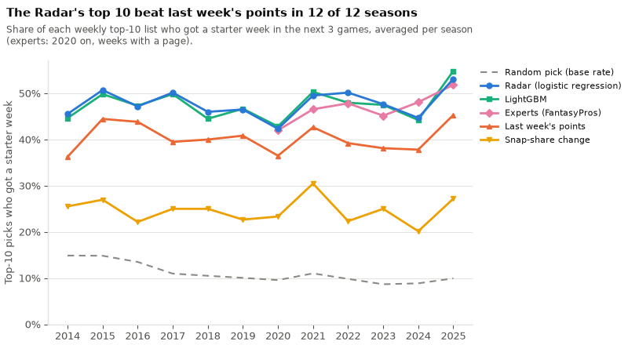
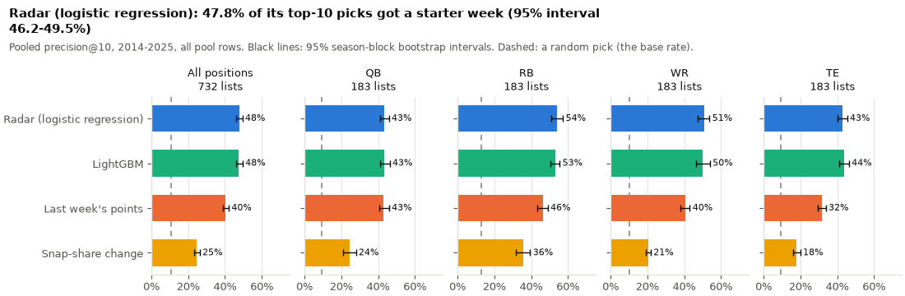
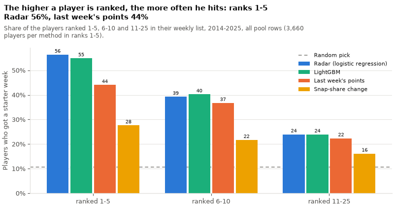
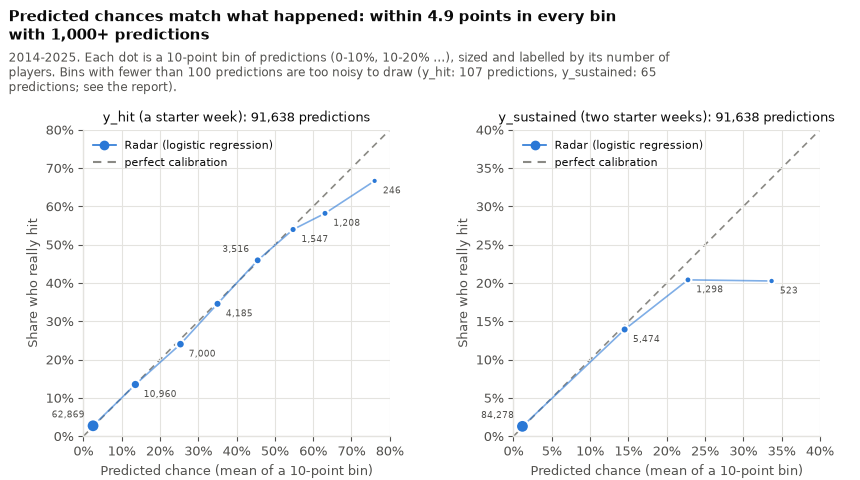
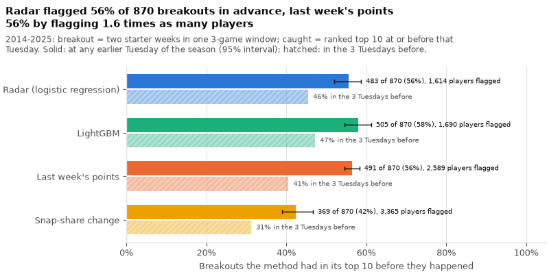

# Waiver Radar evaluation (step C5)

Generated by `uv run twm radar evaluate` from `data/predictions.duckdb` (the predictions store) and `data/waiver_radar/dataset.parquet`.
Generated at 2026-09-28 08:32 UTC in 4 s.

**How to read this.** Every Tuesday of every season from 2014 to 2025, each method ranked the players probably on waivers at each position; the models learned only from earlier seasons (C4, `reports/waiver_radar/backtest.md`). This report grades those stored rankings. **Precision@10** = the share of a list's top 10 who became a fantasy starter soon (see each label). Every rate comes with its counts, and the main ones with a **95% interval**: the range the number would plausibly move within if the same kind of seasons were played again. It comes from the *season-block bootstrap*: draw 12 seasons at random from the 12 test seasons (some twice, some not at all), recompute, repeat 2,000 times (fixed seed 20140907), keep the middle 95%. Whole seasons are drawn because the weeks of one season are not independent (same players, same model). docs/waiver_radar.md ('Evaluation') explains everything in plain words.

## Inputs

- Predictions: the current model version of every (method, label, test season) in the store (the one written last); nothing is re-predicted, so the time machine shows the same rankings.
- The dataset adds names, teams, rostership and the experts' coverage; its labels and pool rows were checked against the store: they agree on every prediction.

| label | method | model versions | predictions |
|---|---|---|---|
| `y_hit` | baseline_ecr | 6 | 50,139 |
| `y_hit` | baseline_last_points | 12 | 91,638 |
| `y_hit` | baseline_snap_delta | 12 | 91,638 |
| `y_hit` | lgbm | 12 | 91,638 |
| `y_hit` | logit | 12 | 91,638 |
| `y_sustained` | baseline_ecr | 6 | 50,139 |
| `y_sustained` | baseline_last_points | 12 | 91,638 |
| `y_sustained` | baseline_snap_delta | 12 | 91,638 |
| `y_sustained` | lgbm | 12 | 91,638 |
| `y_sustained` | logit | 12 | 91,638 |

## Headlines

- `y_hit`: logistic regression precision@10 2014-2025 47.8% (46.2-49.5) over 732 lists (3,501 of 7,320 top-10 picks hit); without rostered 45.5% (43.6-47.5).
- `y_hit`: logistic regression - last week's points: +7.4 (+6.2 to +8.7) points, ahead in 12 of 12 seasons.
- `y_hit`: logistic regression - snap-share change: +23.2 (+21.6 to +24.7) points, ahead in 12 of 12 seasons.
- `y_hit`: logistic regression - LightGBM: +0.2 (-0.3 to +0.8) points.
- `y_hit`: breakouts caught by logistic regression: 55.5% (51.9-58.7) (483 of 870).
- `y_sustained`: logistic regression precision@10 2014-2025 16.0% (15.0-17.0) over 732 lists (1,173 of 7,320 top-10 picks hit); without rostered 14.5% (13.3-15.8).
- `y_sustained`: logistic regression - last week's points: +3.4 (+2.7 to +4.0) points, ahead in 12 of 12 seasons.
- `y_sustained`: logistic regression - snap-share change: +8.7 (+7.8 to +9.5) points, ahead in 12 of 12 seasons.
- `y_sustained`: logistic regression - LightGBM: +0.6 (+0.2 to +1.0) points.
- `y_sustained`: breakouts caught by logistic regression: 55.1% (51.7-58.7) (479 of 870).

## Figures

## Label `y_hit` (at least one starter week in his next 3 games)

732 weekly lists (as-of x position) in 2014-2025, 91,638 pool rows, 9,726 hits: base rate 10.6%, the precision a random pick would get.

Winner (C4 rule: higher pooled precision@10, ties to the simpler model): **logistic regression** (`logit`).

### Precision@10, pooled, with 95% intervals

The share of each list's top 10 who hit, averaged over the lists, with the 95% season-block bootstrap interval in brackets (2,000 resamples of the test seasons). `picks` = hits among the top-10 picks / all top-10 picks. `without rostered`: pool players owned in at least 50% of real leagues (FantasyPros, 2020 on) removed and the lists re-ranked. The experts' ranks exist only from 2020: see their section below.

| method | 2014-2025 all pool rows | 2014-2025 without rostered | 2015-2025 all pool rows | 2015-2025 without rostered | lists | picks (2014-2025) |
|---|---|---|---|---|---|---|
| logistic regression | 47.8% (46.2-49.5) | 45.5% (43.6-47.5) | 48.0% (46.4-49.8) | 45.5% (43.5-47.7) | 732 | 3,501/7,320 |
| LightGBM | 47.6% (45.9-49.6) | 45.2% (43.2-47.1) | 47.8% (46.0-49.9) | 45.2% (43.1-47.4) | 732 | 3,483/7,320 |
| last week's points | 40.4% (38.8-42.0) | 38.9% (37.1-40.8) | 40.7% (39.2-42.4) | 39.2% (37.2-41.0) | 732 | 2,956/7,320 |
| snap-share change | 24.6% (23.1-26.2) | 23.8% (22.3-25.2) | 24.6% (23.0-26.3) | 23.6% (22.1-25.2) | 732 | 1,804/7,320 |

### Paired differences (percentage points, 95% intervals)

Model minus method, on the same lists: each resample draws the same seasons for both, so a hard season counts against both at once. `ahead in` = the share of the 2,000 resamples in which the model was ahead; `seasons won` = seasons in which its precision@10 was higher.

| comparison | 2014-2025 all pool rows | 2014-2025 without rostered | 2015-2025 all pool rows | 2015-2025 without rostered | ahead in (2014-2025) | seasons won (2014-2025) |
|---|---|---|---|---|---|---|
| logistic regression - last week's points | +7.4 (+6.2 to +8.7) | +6.6 (+5.5 to +7.7) | +7.3 (+6.0 to +8.6) | +6.3 (+5.3 to +7.5) | 100% | 12 of 12 |
| logistic regression - snap-share change | +23.2 (+21.6 to +24.7) | +21.7 (+20.2 to +23.2) | +23.4 (+21.8 to +25.0) | +21.9 (+20.2 to +23.5) | 100% | 12 of 12 |
| LightGBM - last week's points | +7.2 (+6.0 to +8.3) | +6.2 (+5.1 to +7.4) | +7.1 (+5.9 to +8.3) | +6.1 (+5.0 to +7.3) | 100% | 12 of 12 |
| LightGBM - snap-share change | +22.9 (+21.4 to +24.5) | +21.4 (+19.8 to +22.9) | +23.3 (+21.7 to +24.8) | +21.6 (+19.9 to +23.3) | 100% | 12 of 12 |
| logistic regression - LightGBM | +0.2 (-0.3 to +0.8) | +0.3 (-0.2 to +0.9) | +0.2 (-0.4 to +0.8) | +0.3 (-0.3 to +0.9) | 78% | 7 of 12 |

### Per season (all pool rows)

One row per test season: its lists, hits and base rate, then each method's precision@10. The last rows give the spread over the seasons.

| season | lists | hits | base rate | logistic regression | LightGBM | last week's points | snap-share change |
|---|---|---|---|---|---|---|---|
| 2014 | 56 | 657 | 14.9% | 45.5% | 44.6% | 36.2% | 25.5% |
| 2015 | 56 | 652 | 14.8% | 50.7% | 49.8% | 44.5% | 27.0% |
| 2016 | 60 | 795 | 13.5% | 47.2% | 47.3% | 43.8% | 22.2% |
| 2017 | 60 | 822 | 11.0% | 50.2% | 49.8% | 39.5% | 25.0% |
| 2018 | 60 | 780 | 10.5% | 46.0% | 44.5% | 40.0% | 25.0% |
| 2019 | 60 | 761 | 10.1% | 46.5% | 46.7% | 40.8% | 22.7% |
| 2020 | 60 | 832 | 9.6% | 42.3% | 42.8% | 36.5% | 23.3% |
| 2021 | 64 | 1,017 | 11.0% | 49.5% | 50.3% | 42.7% | 30.5% |
| 2022 | 64 | 895 | 9.8% | 50.2% | 48.0% | 39.2% | 22.3% |
| 2023 | 64 | 782 | 8.7% | 47.7% | 47.5% | 38.1% | 25.0% |
| 2024 | 64 | 813 | 8.9% | 44.7% | 44.2% | 37.8% | 20.2% |
| 2025 | 64 | 920 | 9.9% | 53.1% | 54.8% | 45.3% | 27.2% |
| *season min* |  |  |  | 42.3% | 42.8% | 36.2% | 20.2% |
| *season median* |  |  |  | 47.4% | 47.4% | 39.8% | 25.0% |
| *season max* |  |  |  | 53.1% | 54.8% | 45.3% | 30.5% |

### Per position (2014-2025, 95% intervals)

All pool rows:

| position | lists | hits | base rate | logistic regression | LightGBM | last week's points | snap-share change | logistic regression - last week's points |
|---|---|---|---|---|---|---|---|---|
| QB | 183 | 1,202 | 9.2% | 43.4% (41.2-45.9) | 43.5% (40.9-46.3) | 43.1% (40.8-45.9) | 24.5% (21.1-28.0) | +0.3 (-0.6 to +1.3) |
| RB | 183 | 2,716 | 13.0% | 54.2% (50.8-57.3) | 53.1% (50.4-55.6) | 46.3% (43.5-49.1) | 35.5% (31.7-39.5) | +7.9 (+5.2 to +10.6) |
| WR | 183 | 3,829 | 10.4% | 50.8% (47.6-53.8) | 50.2% (46.3-54.0) | 40.4% (38.1-43.1) | 20.6% (19.3-21.8) | +10.4 (+8.0 to +13.0) |
| TE | 183 | 1,979 | 9.5% | 42.8% (40.2-45.4) | 43.6% (41.2-46.4) | 31.7% (29.6-33.8) | 18.0% (16.1-19.9) | +11.1 (+8.6 to +13.5) |

Without rostered:

| position | lists | hits | base rate | logistic regression | LightGBM | last week's points | snap-share change | logistic regression - last week's points |
|---|---|---|---|---|---|---|---|---|
| QB | 183 | 1,163 | 8.9% | 42.6% (40.6-44.6) | 42.8% (40.5-45.3) | 42.0% (39.9-44.1) | 24.0% (20.9-27.2) | +0.6 (-0.2 to +1.4) |
| RB | 183 | 2,489 | 12.2% | 50.9% (47.4-54.4) | 49.3% (46.1-52.5) | 43.7% (40.3-47.3) | 33.4% (29.0-38.0) | +7.2 (+4.9 to +9.1) |
| WR | 183 | 3,470 | 9.6% | 46.1% (41.8-50.6) | 45.5% (40.5-50.9) | 38.4% (35.4-41.7) | 19.8% (18.8-20.8) | +7.7 (+5.1 to +10.9) |
| TE | 183 | 1,963 | 9.4% | 42.5% (39.8-45.3) | 43.1% (40.8-45.7) | 31.7% (29.4-34.0) | 17.9% (16.0-19.8) | +10.8 (+8.3 to +13.2) |

### Hit rate by rank (2014-2025)

The share of the players ranked 1-5, 6-10 and 11-25 in their list who hit (hits/players in brackets). A good ranking puts its best calls first, so the rate should fall down the list. The experts are left out (their lists cover 2020 on only).

All pool rows:

| method | ranks 1-5 | ranks 6-10 | ranks 11-25 |
|---|---|---|---|
| logistic regression | 56.4% (2,064/3,660) | 39.3% (1,437/3,660) | 24.0% (2,632/10,980) |
| LightGBM | 54.9% (2,010/3,660) | 40.2% (1,473/3,660) | 23.9% (2,629/10,980) |
| last week's points | 44.0% (1,612/3,660) | 36.7% (1,344/3,660) | 22.4% (2,456/10,980) |
| snap-share change | 27.6% (1,011/3,660) | 21.7% (793/3,660) | 16.1% (1,771/10,980) |

Without rostered:

| method | ranks 1-5 | ranks 6-10 | ranks 11-25 |
|---|---|---|---|
| logistic regression | 54.3% (1,986/3,660) | 36.7% (1,345/3,660) | 22.3% (2,444/10,980) |
| LightGBM | 52.2% (1,912/3,660) | 38.1% (1,394/3,660) | 22.3% (2,448/10,980) |
| last week's points | 42.6% (1,559/3,660) | 35.3% (1,291/3,660) | 20.7% (2,276/10,980) |
| snap-share change | 26.8% (981/3,660) | 20.7% (759/3,660) | 15.3% (1,681/10,980) |

### PR-AUC and Brier (the models' probabilities, all pool rows)

PR-AUC (average precision): how well the probabilities put hits above misses across all rows (higher is better; a random ranking scores the base rate). Brier: the mean squared error of the probability (lower is better); `base-rate Brier` always predicts the hit rate of the seasons before (what an uninformative forecast scores).

| seasons | hits / rows | base-rate Brier | logistic regression PR-AUC | logistic regression Brier | LightGBM PR-AUC | LightGBM Brier |
|---|---|---|---|---|---|---|
| 2014 | 657 / 4,414 | 0.1268 | 0.4061 | 0.1044 | 0.3829 | 0.1121 |
| 2015 | 652 / 4,394 | 0.1264 | 0.4632 | 0.0980 | 0.4364 | 0.1009 |
| 2016 | 795 / 5,888 | 0.1169 | 0.4431 | 0.0909 | 0.4350 | 0.0910 |
| 2017 | 822 / 7,490 | 0.0988 | 0.4519 | 0.0734 | 0.4400 | 0.0743 |
| 2018 | 780 / 7,426 | 0.0948 | 0.4186 | 0.0739 | 0.3983 | 0.0742 |
| 2019 | 761 / 7,566 | 0.0912 | 0.4243 | 0.0694 | 0.4186 | 0.0699 |
| 2020 | 832 / 8,690 | 0.0873 | 0.3751 | 0.0695 | 0.3870 | 0.0693 |
| 2021 | 1,017 / 9,227 | 0.0981 | 0.4319 | 0.0758 | 0.4250 | 0.0762 |
| 2022 | 895 / 9,104 | 0.0890 | 0.4014 | 0.0700 | 0.3879 | 0.0706 |
| 2023 | 782 / 9,013 | 0.0800 | 0.4135 | 0.0615 | 0.4038 | 0.0618 |
| 2024 | 813 / 9,167 | 0.0813 | 0.3917 | 0.0635 | 0.3876 | 0.0635 |
| 2025 | 920 / 9,259 | 0.0896 | 0.4411 | 0.0669 | 0.4453 | 0.0666 |
| 2014-2025 pooled | 9,726 / 91,638 | 0.0950 | 0.4326 | 0.0736 | 0.4181 | 0.0744 |
| QB (2014-2025) | 1,202 / 13,099 |  | 0.4747 | 0.0590 | 0.4715 | 0.0599 |
| RB (2014-2025) | 2,716 / 20,826 |  | 0.4652 | 0.0880 | 0.4448 | 0.0888 |
| WR (2014-2025) | 3,829 / 36,866 |  | 0.4153 | 0.0729 | 0.3980 | 0.0737 |
| TE (2014-2025) | 1,979 / 20,847 |  | 0.3883 | 0.0698 | 0.3769 | 0.0702 |

### Calibration of the winner (logistic regression, 2014-2025)

When the model says 30%, do about 30% hit? First table: rows sorted by predicted probability and cut into 10 bins of equal size. Second table: fixed-width bins (0-10%, 10-20% ...), which show how few rows get a high probability. In a well-calibrated model `mean predicted` and `observed` match; a bin with few rows is noisy.

| equal-count bin | rows | hits | mean predicted | observed | predicted range |
|---|---|---|---|---|---|
| 1 | 9,164 | 43 | 0.0% | 0.5% | 0.0%-0.4% |
| 2 | 9,164 | 55 | 0.5% | 0.6% | 0.4%-0.7% |
| 3 | 9,164 | 95 | 1.0% | 1.0% | 0.7%-1.4% |
| 4 | 9,164 | 193 | 2.0% | 2.1% | 1.4%-2.4% |
| 5 | 9,163 | 271 | 3.0% | 3.0% | 2.4%-3.6% |
| 6 | 9,164 | 439 | 4.4% | 4.8% | 3.6%-5.6% |
| 7 | 9,164 | 711 | 7.9% | 7.8% | 5.6%-10.8% |
| 8 | 9,164 | 1,298 | 13.7% | 14.2% | 10.8%-18.4% |
| 9 | 9,164 | 2,289 | 26.2% | 25.0% | 18.4%-34.3% |
| 10 | 9,163 | 4,332 | 48.3% | 47.3% | 34.3%-100.0% |

| fixed-width bin | rows | hits | mean predicted | observed |
|---|---|---|---|---|
| 0-10% | 62,869 | 1,720 | 2.5% | 2.7% |
| 10-20% | 10,960 | 1,481 | 13.6% | 13.5% |
| 20-30% | 7,000 | 1,683 | 25.3% | 24.0% |
| 30-40% | 4,185 | 1,447 | 35.0% | 34.6% |
| 40-50% | 3,516 | 1,615 | 45.5% | 45.9% |
| 50-60% | 1,547 | 835 | 54.8% | 54.0% |
| 60-70% | 1,208 | 703 | 63.1% | 58.2% |
| 70-80% | 246 | 164 | 76.0% | 66.7% |
| 80-90% | 66 | 45 | 83.5% | 68.2% |
| 90-100% | 41 | 33 | 99.0% | 80.5% |

### The experts (2020-2025, on the lists where their page existed)

FantasyPros' positional ranks visible at the as-of (C4: rest-of-season page, else weekly; saved on Fridays, so they had not seen the weekend's games yet). Every method graded on the same 356 lists; intervals resample these 6 seasons only, so they are wide.

| method | all pool rows | without rostered |
|---|---|---|
| logistic regression | 48.4% (45.3-51.1) | 43.7% (41.3-46.3) |
| LightGBM | 48.5% (45.2-51.7) | 43.5% (40.7-46.3) |
| the experts (FantasyPros) | 46.9% (44.6-49.3) | 42.0% (40.2-44.3) |
| last week's points | 40.3% (38.0-42.9) | 37.4% (35.2-39.8) |
| snap-share change | 25.4% (22.8-28.2) | 23.7% (21.3-26.0) |
| *logistic regression - experts* (won 5 of 6 seasons) | +1.5 (-0.4 to +2.9) | +1.7 (-0.0 to +3.2) |
| *LightGBM - experts* (won 5 of 6 seasons) | +1.6 (-0.7 to +3.3) | +1.5 (-0.4 to +3.2) |

### Breakouts caught

A **breakout** is a player-season in which a player the Radar ranked (a pool row) had two starter weeks within one 3-game window (`y_sustained`) at that Tuesday or a later one of the same season (by then he may have left the pool). His **breakout Tuesday** is the first such as-of. A method **caught** him if it ranked him in the top 10 of his position at the breakout Tuesday or an earlier one of that season; a ranking made after the breakout never counts. `in the 3 Tuesdays before` asks for a top-10 rank at the breakout Tuesday or one of the two before it (a tighter test: a manager who added him early might have dropped him). `players flagged` = the different players a method put in its top 10 at least once: 'at least once' rewards a method whose top 10 changes a lot from week to week, so read the two together. Each method is judged with its own `y_hit` lists.

870 breakouts in 2014-2025 (832 of them, 95.6%, still in the pool at the breakout Tuesday).

All pool rows (2014-2025):

| method | caught (95% interval) | caught/breakouts | in the 3 Tuesdays before | players flagged | caught per 100 flagged |
|---|---|---|---|---|---|
| logistic regression | 55.5% (51.9-58.7) | 483/870 | 45.5% (396) | 1,614 | 30 |
| LightGBM | 58.0% (54.6-61.2) | 505/870 | 47.2% (411) | 1,690 | 30 |
| last week's points | 56.4% (54.6-58.3) | 491/870 | 40.6% (353) | 2,589 | 19 |
| snap-share change | 42.4% (38.9-46.7) | 369/870 | 31.3% (272) | 3,365 | 11 |

Without rostered (2014-2025):

| method | caught (95% interval) | caught/breakouts | in the 3 Tuesdays before | players flagged | caught per 100 flagged |
|---|---|---|---|---|---|
| logistic regression | 57.5% (55.8-59.4) | 486/845 | 45.9% (388) | 1,662 | 29 |
| LightGBM | 59.4% (57.4-61.3) | 502/845 | 47.9% (405) | 1,747 | 29 |
| last week's points | 58.2% (56.1-60.5) | 492/845 | 42.0% (355) | 2,624 | 19 |
| snap-share change | 42.8% (39.2-46.9) | 362/845 | 31.6% (267) | 3,375 | 11 |

Paired differences in the share caught (2014-2025, percentage points, 95% intervals, same breakouts):

| comparison | pool rows | caught | in the 3 Tuesdays before |
|---|---|---|---|
| logistic regression - last week's points | all pool rows | -0.9 (-3.6 to +1.4) | +4.9 (+1.7 to +8.2) |
| logistic regression - last week's points | without rostered | -0.7 (-3.3 to +1.5) | +3.9 (+1.0 to +6.9) |
| logistic regression - snap-share change | all pool rows | +13.1 (+6.8 to +18.7) | +14.3 (+9.0 to +19.5) |
| logistic regression - snap-share change | without rostered | +14.7 (+9.7 to +18.8) | +14.3 (+10.1 to +17.9) |

On the experts' lists (2020-2025): only the lists where their page existed, for every method, and only breakouts whose breakout Tuesday's list was one of them:

| method | all pool rows | without rostered | players flagged |
|---|---|---|---|
| logistic regression | 49.3% (45.7-52.9) 207/420 | 51.4% (44.1-56.3) 203/395 | 763 |
| LightGBM | 54.0% (49.8-58.7) 227/420 | 53.9% (46.3-60.1) 213/395 | 810 |
| the experts (FantasyPros) | 51.2% (48.5-54.1) 215/420 | 50.4% (45.1-55.3) 199/395 | 711 |
| last week's points | 52.4% (49.2-55.3) 220/420 | 55.4% (48.4-63.1) 219/395 | 1,296 |
| snap-share change | 43.6% (38.6-49.4) 183/420 | 44.6% (39.3-50.1) 176/395 | 1,705 |
| *logistic regression - experts* | -1.9 (-4.1 to +0.4) | +1.0 (-2.0 to +3.7) |  |
| *LightGBM - experts* | +2.9 (+0.0 to +6.2) | +3.5 (+0.8 to +5.9) |  |

Per position (2014-2025, all pool rows; caught in brackets):

| position | breakouts | logistic regression | LightGBM | last week's points | snap-share change |
|---|---|---|---|---|---|
| QB | 120 | 84.2% (101) | 85.0% (102) | 85.0% (102) | 60.8% (73) |
| RB | 281 | 49.1% (138) | 52.7% (148) | 52.7% (148) | 48.0% (135) |
| WR | 308 | 45.8% (141) | 47.1% (145) | 45.1% (139) | 28.9% (89) |
| TE | 161 | 64.0% (103) | 68.3% (110) | 63.4% (102) | 44.7% (72) |

Per season (all pool rows):

| season | breakouts | logistic regression | LightGBM | last week's points | snap-share change |
|---|---|---|---|---|---|
| 2014 | 59 | 54.2% (32) | 62.7% (37) | 54.2% (32) | 40.7% (24) |
| 2015 | 65 | 63.1% (41) | 63.1% (41) | 60.0% (39) | 41.5% (27) |
| 2016 | 71 | 53.5% (38) | 53.5% (38) | 60.6% (43) | 33.8% (24) |
| 2017 | 74 | 63.5% (47) | 59.5% (44) | 62.2% (46) | 43.2% (32) |
| 2018 | 64 | 54.7% (35) | 60.9% (39) | 57.8% (37) | 54.7% (35) |
| 2019 | 78 | 59.0% (46) | 55.1% (43) | 55.1% (43) | 41.0% (32) |
| 2020 | 76 | 53.9% (41) | 60.5% (46) | 55.3% (42) | 39.5% (30) |
| 2021 | 89 | 42.7% (38) | 48.3% (43) | 52.8% (47) | 42.7% (38) |
| 2022 | 73 | 58.9% (43) | 65.8% (48) | 57.5% (42) | 35.6% (26) |
| 2023 | 67 | 56.7% (38) | 58.2% (39) | 55.2% (37) | 43.3% (29) |
| 2024 | 74 | 59.5% (44) | 64.9% (48) | 56.8% (42) | 36.5% (27) |
| 2025 | 80 | 50.0% (40) | 48.8% (39) | 51.2% (41) | 56.2% (45) |

The 10 biggest breakouts the logistic regression caught (most starter weeks after the breakout Tuesday, then points). `next 3 weeks` = his weekly rank at his position in the window (`-` = no stat line); `preseason rank` = the pool's preseason list (last season's points per game rank before 2020, FantasyPros from 2020; `-` = unranked); `owned` = FantasyPros rostership that week (2020 on); best rank = the best rank in the lists up to the breakout Tuesday (with the week).

| season | player | pos | team | breakout Tuesday after week | next 3 weeks (rank) | starter weeks after | points after | preseason rank | owned | logistic regression best rank | last week's points best rank |
|---|---|---|---|---|---|---|---|---|---|---|---|
| 2017 | Alvin Kamara | RB | NO | 1 | wk 2: 32, wk 3: 17, wk 4: 6 | 13 | 312.6 | - | - | 2 (wk 1) | 1 |
| 2018 | Matt Ryan | QB | ATL | 1 | wk 2: 5, wk 3: 2, wk 4: 8 | 12 | 346.1 | 22 | - | 2 (wk 1) | 3 |
| 2024 | Bucky Irving | RB | TB | 2 | wk 3: 22, wk 4: 23, wk 5: 46 | 12 | 232.6 | 54 | - | 4 (wk 2) | 24 |
| 2015 | Gary Barnidge | TE | CLE | 2 | wk 3: 2, wk 4: 4, wk 5: 3 | 12 | 227.8 | 54 | - | 5 (wk 2) | 14 |
| 2023 | Jerome Ford | RB | CLE | 1 | wk 2: 6, wk 3: 7, wk 4: 24 | 12 | 209.6 | 58 | - | 9 (wk 1) | 30 |
| 2018 | Andrew Luck | QB | IND | 2 | wk 3: 20, wk 4: 3, wk 5: 4 | 11 | 297.1 | - | - | 4 (wk 2) | 7 |
| 2024 | Chuba Hubbard | RB | CAR | 1 | wk 2: 24, wk 3: 4, wk 4: 7 | 11 | 240.2 | 40 | - | 7 (wk 1) | 24 |
| 2021 | Dalton Schultz | TE | DAL | 2 | wk 3: 1, wk 4: 5, wk 5: 7 | 11 | 194.5 | 34 | 2% | 3 (wk 2) | 11 |
| 2025 | Matthew Stafford | QB | LA | 2 | wk 3: 15, wk 4: 2, wk 5: 8 | 10 | 319.5 | 25 | 29% | 2 (wk 1) | 1 |
| 2022 | Geno Smith | QB | SEA | 2 | wk 3: 7, wk 4: 2, wk 5: 5 | 10 | 280.6 | 32 | 4% | 3 (wk 2) | 6 |

The 10 biggest breakouts the logistic regression missed (most starter weeks after the breakout Tuesday, then points). `next 3 weeks` = his weekly rank at his position in the window (`-` = no stat line); `preseason rank` = the pool's preseason list (last season's points per game rank before 2020, FantasyPros from 2020; `-` = unranked); `owned` = FantasyPros rostership that week (2020 on); best rank = the best rank in the lists up to the breakout Tuesday (with the week).

| season | player | pos | team | breakout Tuesday after week | next 3 weeks (rank) | starter weeks after | points after | preseason rank | owned | logistic regression best rank | last week's points best rank |
|---|---|---|---|---|---|---|---|---|---|---|---|
| 2016 | Jordan Howard | RB | CHI | 1 | wk 2: 51, wk 3: 20, wk 4: 15 | 11 | 230.1 | - | - | 80 (wk 1) | 151 |
| 2018 | Julian Edelman | WR | NE | 5 | wk 6: 24, wk 7: 21, wk 8: 12 | 10 | 194.7 | - | - | 40 (wk 5) | 9 |
| 2021 | Zach Ertz | TE | PHI | 1 | wk 2: 53, wk 3: 7, wk 4: 12 | 10 | 175.3 | 22 | 31% | 11 (wk 1) | 9 |
| 2020 | Justin Herbert | QB | LAC | 2 | wk 3: 20, wk 4: 9, wk 5: 4 | 9 | 310.6 | 35 | - | 15 (wk 1) | 97 |
| 2022 | Tyler Lockett | WR | SEA | 1 | wk 2: 15, wk 3: 21, wk 4: 26 | 9 | 231.5 | 41 | - | 14 (wk 1) | 27 |
| 2025 | Jacoby Brissett | QB | ARI | 4 | wk 5: 33, wk 6: 7, wk 7: 12 | 9 | 227.2 | 57 | - | 21 (wk 2) | 17 |
| 2020 | Robert Tonyan | TE | GB | 1 | wk 2: 17, wk 3: 4, wk 4: 2 | 9 | 176.6 | 51 | - | 42 (wk 1) | 94 |
| 2021 | Hunter Renfrow | WR | LV | 1 | wk 2: 47, wk 3: 15, wk 4: 23 | 8 | 246.1 | 86 | 2% | 12 (wk 1) | 4 |
| 2025 | Jaxson Dart | QB | NYG | 3 | wk 4: 10, wk 5: 20, wk 6: 3 | 8 | 241.6 | 33 | 7% | 12 (wk 1) | 18 |
| 2018 | Tyler Boyd | WR | CIN | 1 | wk 2: 15, wk 3: 4, wk 4: 18 | 8 | 215.5 | 93 | - | 18 (wk 1) | 23 |

## Label `y_sustained` (at least two starter weeks in his next 3 games)

732 weekly lists (as-of x position) in 2014-2025, 91,638 pool rows, 2,251 hits: base rate 2.5%, the precision a random pick would get.

Winner (C4 rule: higher pooled precision@10, ties to the simpler model): **logistic regression** (`logit`).

### Precision@10, pooled, with 95% intervals

The share of each list's top 10 who hit, averaged over the lists, with the 95% season-block bootstrap interval in brackets (2,000 resamples of the test seasons). `picks` = hits among the top-10 picks / all top-10 picks. `without rostered`: pool players owned in at least 50% of real leagues (FantasyPros, 2020 on) removed and the lists re-ranked. The experts' ranks exist only from 2020: see their section below.

| method | 2014-2025 all pool rows | 2014-2025 without rostered | 2015-2025 all pool rows | 2015-2025 without rostered | lists | picks (2014-2025) |
|---|---|---|---|---|---|---|
| logistic regression | 16.0% (15.0-17.0) | 14.5% (13.3-15.8) | 16.2% (15.2-17.2) | 14.6% (13.2-15.9) | 732 | 1,173/7,320 |
| LightGBM | 15.4% (14.3-16.5) | 14.0% (12.6-15.4) | 15.7% (14.6-16.7) | 14.1% (12.6-15.6) | 732 | 1,128/7,320 |
| last week's points | 12.6% (11.5-13.8) | 11.7% (10.5-13.1) | 12.9% (11.8-14.1) | 11.9% (10.6-13.3) | 732 | 923/7,320 |
| snap-share change | 7.3% (6.7-7.9) | 6.9% (6.3-7.5) | 7.3% (6.7-7.9) | 6.8% (6.2-7.5) | 732 | 537/7,320 |

### Paired differences (percentage points, 95% intervals)

Model minus method, on the same lists: each resample draws the same seasons for both, so a hard season counts against both at once. `ahead in` = the share of the 2,000 resamples in which the model was ahead; `seasons won` = seasons in which its precision@10 was higher.

| comparison | 2014-2025 all pool rows | 2014-2025 without rostered | 2015-2025 all pool rows | 2015-2025 without rostered | ahead in (2014-2025) | seasons won (2014-2025) |
|---|---|---|---|---|---|---|
| logistic regression - last week's points | +3.4 (+2.7 to +4.0) | +2.8 (+2.2 to +3.3) | +3.3 (+2.6 to +4.0) | +2.7 (+2.0 to +3.2) | 100% | 12 of 12 |
| logistic regression - snap-share change | +8.7 (+7.8 to +9.5) | +7.6 (+6.6 to +8.6) | +8.9 (+8.0 to +9.6) | +7.7 (+6.7 to +8.8) | 100% | 12 of 12 |
| LightGBM - last week's points | +2.8 (+2.2 to +3.4) | +2.3 (+1.7 to +2.8) | +2.8 (+2.2 to +3.4) | +2.2 (+1.6 to +2.8) | 100% | 12 of 12 |
| LightGBM - snap-share change | +8.1 (+7.1 to +9.0) | +7.1 (+6.0 to +8.2) | +8.3 (+7.4 to +9.1) | +7.3 (+6.1 to +8.3) | 100% | 12 of 12 |
| logistic regression - LightGBM | +0.6 (+0.2 to +1.0) | +0.5 (+0.1 to +0.9) | +0.6 (+0.1 to +1.0) | +0.4 (+0.1 to +0.8) | 100% | 10 of 12 |

### Per season (all pool rows)

One row per test season: its lists, hits and base rate, then each method's precision@10. The last rows give the spread over the seasons.

| season | lists | hits | base rate | logistic regression | LightGBM | last week's points | snap-share change |
|---|---|---|---|---|---|---|---|
| 2014 | 56 | 141 | 3.2% | 13.6% | 12.3% | 9.3% | 7.5% |
| 2015 | 56 | 178 | 4.1% | 18.0% | 17.7% | 17.3% | 8.8% |
| 2016 | 60 | 192 | 3.3% | 15.3% | 16.2% | 14.2% | 7.3% |
| 2017 | 60 | 207 | 2.8% | 18.2% | 17.7% | 14.3% | 8.3% |
| 2018 | 60 | 155 | 2.1% | 12.5% | 12.0% | 10.0% | 7.2% |
| 2019 | 60 | 204 | 2.7% | 16.5% | 16.0% | 13.2% | 7.3% |
| 2020 | 60 | 181 | 2.1% | 15.3% | 15.3% | 11.5% | 5.5% |
| 2021 | 64 | 220 | 2.4% | 15.9% | 14.5% | 11.4% | 8.1% |
| 2022 | 64 | 193 | 2.1% | 16.4% | 15.2% | 12.3% | 6.1% |
| 2023 | 64 | 186 | 2.1% | 17.7% | 18.0% | 13.0% | 8.1% |
| 2024 | 64 | 171 | 1.9% | 14.2% | 13.1% | 10.6% | 5.8% |
| 2025 | 64 | 223 | 2.4% | 18.4% | 16.9% | 14.4% | 8.1% |
| *season min* |  |  |  | 12.5% | 12.0% | 9.3% | 5.5% |
| *season median* |  |  |  | 16.2% | 15.7% | 12.7% | 7.4% |
| *season max* |  |  |  | 18.4% | 18.0% | 17.3% | 8.8% |

### Per position (2014-2025, 95% intervals)

All pool rows:

| position | lists | hits | base rate | logistic regression | LightGBM | last week's points | snap-share change | logistic regression - last week's points |
|---|---|---|---|---|---|---|---|---|
| QB | 183 | 332 | 2.5% | 14.8% (13.0-16.6) | 14.5% (12.6-16.6) | 14.8% (13.0-16.6) | 7.4% (5.8-9.0) | -0.1 (-0.8 to +0.8) |
| RB | 183 | 763 | 3.7% | 21.1% (18.6-23.6) | 19.1% (16.7-21.7) | 16.4% (14.2-19.1) | 12.8% (10.5-15.3) | +4.6 (+2.9 to +6.3) |
| WR | 183 | 768 | 2.1% | 15.2% (12.8-17.5) | 15.2% (12.5-18.1) | 10.8% (9.0-12.5) | 4.8% (3.5-5.9) | +4.4 (+2.5 to +6.3) |
| TE | 183 | 388 | 1.9% | 13.1% (11.7-14.6) | 12.8% (11.4-14.3) | 8.4% (6.9-10.0) | 4.4% (3.6-5.4) | +4.6 (+3.5 to +5.7) |

Without rostered:

| position | lists | hits | base rate | logistic regression | LightGBM | last week's points | snap-share change | logistic regression - last week's points |
|---|---|---|---|---|---|---|---|---|
| QB | 183 | 316 | 2.4% | 14.3% (12.5-16.2) | 14.3% (12.3-16.3) | 14.3% (12.6-16.0) | 7.3% (5.7-9.0) | +0.1 (-0.5 to +0.6) |
| RB | 183 | 668 | 3.3% | 18.1% (15.0-21.3) | 16.5% (13.7-19.3) | 14.6% (11.9-17.7) | 11.5% (8.8-14.4) | +3.5 (+1.4 to +5.4) |
| WR | 183 | 664 | 1.8% | 12.8% (10.4-15.6) | 12.7% (9.6-16.4) | 9.7% (7.7-11.7) | 4.4% (3.2-5.5) | +3.2 (+1.7 to +4.8) |
| TE | 183 | 379 | 1.8% | 12.7% (11.2-14.4) | 12.4% (10.9-14.0) | 8.3% (6.7-9.9) | 4.4% (3.6-5.2) | +4.4 (+3.3 to +5.5) |

### Hit rate by rank (2014-2025)

The share of the players ranked 1-5, 6-10 and 11-25 in their list who hit (hits/players in brackets). A good ranking puts its best calls first, so the rate should fall down the list. The experts are left out (their lists cover 2020 on only).

All pool rows:

| method | ranks 1-5 | ranks 6-10 | ranks 11-25 |
|---|---|---|---|
| logistic regression | 19.8% (723/3,660) | 12.3% (450/3,660) | 5.4% (593/10,980) |
| LightGBM | 18.5% (677/3,660) | 12.3% (451/3,660) | 5.5% (606/10,980) |
| last week's points | 15.1% (552/3,660) | 10.1% (371/3,660) | 5.7% (622/10,980) |
| snap-share change | 8.4% (308/3,660) | 6.3% (229/3,660) | 3.8% (417/10,980) |

Without rostered:

| method | ranks 1-5 | ranks 6-10 | ranks 11-25 |
|---|---|---|---|
| logistic regression | 18.1% (661/3,660) | 10.9% (400/3,660) | 4.8% (523/10,980) |
| LightGBM | 16.7% (612/3,660) | 11.3% (412/3,660) | 4.9% (535/10,980) |
| last week's points | 14.1% (517/3,660) | 9.3% (340/3,660) | 5.0% (551/10,980) |
| snap-share change | 8.1% (297/3,660) | 5.7% (207/3,660) | 3.5% (379/10,980) |

### PR-AUC and Brier (the models' probabilities, all pool rows)

PR-AUC (average precision): how well the probabilities put hits above misses across all rows (higher is better; a random ranking scores the base rate). Brier: the mean squared error of the probability (lower is better); `base-rate Brier` always predicts the hit rate of the seasons before (what an uninformative forecast scores).

| seasons | hits / rows | base-rate Brier | logistic regression PR-AUC | logistic regression Brier | LightGBM PR-AUC | LightGBM Brier |
|---|---|---|---|---|---|---|
| 2014 | 141 / 4,414 | 0.0309 | 0.1125 | 0.0301 | 0.1053 | 0.0331 |
| 2015 | 178 / 4,394 | 0.0389 | 0.1703 | 0.0358 | 0.1495 | 0.0362 |
| 2016 | 192 / 5,888 | 0.0316 | 0.1561 | 0.0295 | 0.1568 | 0.0292 |
| 2017 | 207 / 7,490 | 0.0269 | 0.1813 | 0.0239 | 0.1752 | 0.0241 |
| 2018 | 155 / 7,426 | 0.0206 | 0.1418 | 0.0194 | 0.1326 | 0.0193 |
| 2019 | 204 / 7,566 | 0.0262 | 0.1647 | 0.0239 | 0.1508 | 0.0244 |
| 2020 | 181 / 8,690 | 0.0205 | 0.1562 | 0.0187 | 0.1588 | 0.0186 |
| 2021 | 220 / 9,227 | 0.0233 | 0.1431 | 0.0221 | 0.1571 | 0.0217 |
| 2022 | 193 / 9,104 | 0.0208 | 0.1810 | 0.0185 | 0.1561 | 0.0188 |
| 2023 | 186 / 9,013 | 0.0202 | 0.1793 | 0.0181 | 0.1548 | 0.0182 |
| 2024 | 171 / 9,167 | 0.0184 | 0.1618 | 0.0166 | 0.1535 | 0.0168 |
| 2025 | 223 / 9,259 | 0.0235 | 0.1736 | 0.0213 | 0.1680 | 0.0217 |
| 2014-2025 pooled | 2,251 / 91,638 | 0.0240 | 0.1595 | 0.0220 | 0.1478 | 0.0222 |
| QB (2014-2025) | 332 / 13,099 |  | 0.1778 | 0.0224 | 0.1671 | 0.0230 |
| RB (2014-2025) | 763 / 20,826 |  | 0.1966 | 0.0319 | 0.1768 | 0.0324 |
| WR (2014-2025) | 768 / 36,866 |  | 0.1275 | 0.0191 | 0.1173 | 0.0193 |
| TE (2014-2025) | 388 / 20,847 |  | 0.1440 | 0.0169 | 0.1422 | 0.0169 |

### Calibration of the winner (logistic regression, 2014-2025)

When the model says 30%, do about 30% hit? First table: rows sorted by predicted probability and cut into 10 bins of equal size. Second table: fixed-width bins (0-10%, 10-20% ...), which show how few rows get a high probability. In a well-calibrated model `mean predicted` and `observed` match; a bin with few rows is noisy.

| equal-count bin | rows | hits | mean predicted | observed | predicted range |
|---|---|---|---|---|---|
| 1 | 9,164 | 12 | 0.0% | 0.1% | 0.0%-0.0% |
| 2 | 9,164 | 3 | 0.0% | 0.0% | 0.0%-0.0% |
| 3 | 9,164 | 12 | 0.0% | 0.1% | 0.0%-0.1% |
| 4 | 9,164 | 14 | 0.1% | 0.2% | 0.1%-0.2% |
| 5 | 9,163 | 33 | 0.3% | 0.4% | 0.2%-0.4% |
| 6 | 9,164 | 51 | 0.5% | 0.6% | 0.4%-0.6% |
| 7 | 9,164 | 99 | 0.9% | 1.1% | 0.6%-1.3% |
| 8 | 9,164 | 175 | 2.1% | 1.9% | 1.3%-3.1% |
| 9 | 9,164 | 496 | 5.1% | 5.4% | 3.1%-8.1% |
| 10 | 9,163 | 1,356 | 16.0% | 14.8% | 8.1%-100.0% |

| fixed-width bin | rows | hits | mean predicted | observed |
|---|---|---|---|---|
| 0-10% | 84,278 | 1,091 | 1.2% | 1.3% |
| 10-20% | 5,474 | 763 | 14.5% | 13.9% |
| 20-30% | 1,298 | 265 | 22.8% | 20.4% |
| 30-40% | 523 | 106 | 33.7% | 20.3% |
| 40-50% | 30 | 12 | 44.1% | 40.0% |
| 50-60% | 5 | 3 | 50.0% | 60.0% |
| 60-70% | 6 | 3 | 63.6% | 50.0% |
| 70-80% | 4 | 0 | 73.6% | 0.0% |
| 80-90% | 0 | 0 | - | - |
| 90-100% | 20 | 8 | 99.6% | 40.0% |

### The experts (2020-2025, on the lists where their page existed)

FantasyPros' positional ranks visible at the as-of (C4: rest-of-season page, else weekly; saved on Fridays, so they had not seen the weekend's games yet). Every method graded on the same 356 lists; intervals resample these 6 seasons only, so they are wide.

| method | all pool rows | without rostered |
|---|---|---|
| logistic regression | 16.6% (15.1-18.1) | 13.5% (11.8-15.1) |
| LightGBM | 15.8% (14.4-17.2) | 12.9% (10.9-14.6) |
| the experts (FantasyPros) | 15.7% (14.2-17.2) | 12.7% (11.1-14.3) |
| last week's points | 12.6% (11.4-13.9) | 10.7% (9.5-11.8) |
| snap-share change | 7.3% (6.3-8.3) | 6.4% (5.7-7.1) |
| *logistic regression - experts* (won 6 of 6 seasons) | +0.9 (+0.4 to +1.5) | +0.8 (+0.2 to +1.5) |
| *LightGBM - experts* (won 3 of 6 seasons) | +0.1 (-0.7 to +0.9) | +0.2 (-0.5 to +0.9) |

### Breakouts caught

A **breakout** is a player-season in which a player the Radar ranked (a pool row) had two starter weeks within one 3-game window (`y_sustained`) at that Tuesday or a later one of the same season (by then he may have left the pool). His **breakout Tuesday** is the first such as-of. A method **caught** him if it ranked him in the top 10 of his position at the breakout Tuesday or an earlier one of that season; a ranking made after the breakout never counts. `in the 3 Tuesdays before` asks for a top-10 rank at the breakout Tuesday or one of the two before it (a tighter test: a manager who added him early might have dropped him). `players flagged` = the different players a method put in its top 10 at least once: 'at least once' rewards a method whose top 10 changes a lot from week to week, so read the two together. Each method is judged with its own `y_sustained` lists.

870 breakouts in 2014-2025 (832 of them, 95.6%, still in the pool at the breakout Tuesday).

All pool rows (2014-2025):

| method | caught (95% interval) | caught/breakouts | in the 3 Tuesdays before | players flagged | caught per 100 flagged |
|---|---|---|---|---|---|
| logistic regression | 55.1% (51.7-58.7) | 479/870 | 45.4% (395) | 1,646 | 29 |
| LightGBM | 58.3% (56.2-60.3) | 507/870 | 47.2% (411) | 1,742 | 29 |
| last week's points | 56.4% (54.6-58.3) | 491/870 | 40.6% (353) | 2,589 | 19 |
| snap-share change | 42.4% (38.9-46.7) | 369/870 | 31.3% (272) | 3,365 | 11 |

Without rostered (2014-2025):

| method | caught (95% interval) | caught/breakouts | in the 3 Tuesdays before | players flagged | caught per 100 flagged |
|---|---|---|---|---|---|
| logistic regression | 56.6% (54.1-59.2) | 478/845 | 45.9% (388) | 1,697 | 28 |
| LightGBM | 58.9% (57.3-60.4) | 498/845 | 46.5% (393) | 1,803 | 28 |
| last week's points | 58.2% (56.1-60.5) | 492/845 | 42.0% (355) | 2,624 | 19 |
| snap-share change | 42.8% (39.2-46.9) | 362/845 | 31.6% (267) | 3,375 | 11 |

Paired differences in the share caught (2014-2025, percentage points, 95% intervals, same breakouts):

| comparison | pool rows | caught | in the 3 Tuesdays before |
|---|---|---|---|
| logistic regression - last week's points | all pool rows | -1.4 (-3.9 to +1.4) | +4.8 (+1.7 to +7.8) |
| logistic regression - last week's points | without rostered | -1.7 (-5.3 to +1.7) | +3.9 (+0.7 to +7.2) |
| logistic regression - snap-share change | all pool rows | +12.6 (+6.3 to +18.7) | +14.1 (+8.9 to +19.8) |
| logistic regression - snap-share change | without rostered | +13.7 (+8.1 to +18.9) | +14.3 (+10.1 to +18.2) |

On the experts' lists (2020-2025): only the lists where their page existed, for every method, and only breakouts whose breakout Tuesday's list was one of them:

| method | all pool rows | without rostered | players flagged |
|---|---|---|---|
| logistic regression | 48.8% (46.5-51.5) 205/420 | 50.1% (45.1-53.7) 198/395 | 769 |
| LightGBM | 53.3% (49.7-56.4) 224/420 | 52.9% (45.0-59.2) 209/395 | 833 |
| the experts (FantasyPros) | 51.2% (48.5-54.1) 215/420 | 50.4% (45.1-55.3) 199/395 | 711 |
| last week's points | 52.4% (49.2-55.3) 220/420 | 55.4% (48.4-63.1) 219/395 | 1,296 |
| snap-share change | 43.6% (38.6-49.4) 183/420 | 44.6% (39.3-50.1) 176/395 | 1,705 |
| *logistic regression - experts* | -2.4 (-3.8 to -1.1) | -0.3 (-1.9 to +1.2) |  |
| *LightGBM - experts* | +2.1 (-0.5 to +4.7) | +2.5 (-1.1 to +6.6) |  |

Per position (2014-2025, all pool rows; caught in brackets):

| position | breakouts | logistic regression | LightGBM | last week's points | snap-share change |
|---|---|---|---|---|---|
| QB | 120 | 83.3% (100) | 83.3% (100) | 85.0% (102) | 60.8% (73) |
| RB | 281 | 48.4% (136) | 52.7% (148) | 52.7% (148) | 48.0% (135) |
| WR | 308 | 44.8% (138) | 50.0% (154) | 45.1% (139) | 28.9% (89) |
| TE | 161 | 65.2% (105) | 65.2% (105) | 63.4% (102) | 44.7% (72) |

Per season (all pool rows):

| season | breakouts | logistic regression | LightGBM | last week's points | snap-share change |
|---|---|---|---|---|---|
| 2014 | 59 | 52.5% (31) | 62.7% (37) | 54.2% (32) | 40.7% (24) |
| 2015 | 65 | 58.5% (38) | 58.5% (38) | 60.0% (39) | 41.5% (27) |
| 2016 | 71 | 54.9% (39) | 52.1% (37) | 60.6% (43) | 33.8% (24) |
| 2017 | 74 | 63.5% (47) | 60.8% (45) | 62.2% (46) | 43.2% (32) |
| 2018 | 64 | 51.6% (33) | 62.5% (40) | 57.8% (37) | 54.7% (35) |
| 2019 | 78 | 59.0% (46) | 60.3% (47) | 55.1% (43) | 41.0% (32) |
| 2020 | 76 | 50.0% (38) | 56.6% (43) | 55.3% (42) | 39.5% (30) |
| 2021 | 89 | 46.1% (41) | 53.9% (48) | 52.8% (47) | 42.7% (38) |
| 2022 | 73 | 54.8% (40) | 60.3% (44) | 57.5% (42) | 35.6% (26) |
| 2023 | 67 | 59.7% (40) | 56.7% (38) | 55.2% (37) | 43.3% (29) |
| 2024 | 74 | 64.9% (48) | 63.5% (47) | 56.8% (42) | 36.5% (27) |
| 2025 | 80 | 47.5% (38) | 53.8% (43) | 51.2% (41) | 56.2% (45) |

The 10 biggest breakouts the logistic regression caught (most starter weeks after the breakout Tuesday, then points). `next 3 weeks` = his weekly rank at his position in the window (`-` = no stat line); `preseason rank` = the pool's preseason list (last season's points per game rank before 2020, FantasyPros from 2020; `-` = unranked); `owned` = FantasyPros rostership that week (2020 on); best rank = the best rank in the lists up to the breakout Tuesday (with the week).

| season | player | pos | team | breakout Tuesday after week | next 3 weeks (rank) | starter weeks after | points after | preseason rank | owned | logistic regression best rank | last week's points best rank |
|---|---|---|---|---|---|---|---|---|---|---|---|
| 2017 | Alvin Kamara | RB | NO | 1 | wk 2: 32, wk 3: 17, wk 4: 6 | 13 | 312.6 | - | - | 1 (wk 1) | 1 |
| 2018 | Matt Ryan | QB | ATL | 1 | wk 2: 5, wk 3: 2, wk 4: 8 | 12 | 346.1 | 22 | - | 1 (wk 1) | 3 |
| 2024 | Bucky Irving | RB | TB | 2 | wk 3: 22, wk 4: 23, wk 5: 46 | 12 | 232.6 | 54 | - | 3 (wk 2) | 24 |
| 2015 | Gary Barnidge | TE | CLE | 2 | wk 3: 2, wk 4: 4, wk 5: 3 | 12 | 227.8 | 54 | - | 6 (wk 2) | 14 |
| 2023 | Jerome Ford | RB | CLE | 1 | wk 2: 6, wk 3: 7, wk 4: 24 | 12 | 209.6 | 58 | - | 9 (wk 1) | 30 |
| 2018 | Andrew Luck | QB | IND | 2 | wk 3: 20, wk 4: 3, wk 5: 4 | 11 | 297.1 | - | - | 3 (wk 2) | 7 |
| 2024 | Chuba Hubbard | RB | CAR | 1 | wk 2: 24, wk 3: 4, wk 4: 7 | 11 | 240.2 | 40 | - | 9 (wk 1) | 24 |
| 2021 | Dalton Schultz | TE | DAL | 2 | wk 3: 1, wk 4: 5, wk 5: 7 | 11 | 194.5 | 34 | 2% | 1 (wk 2) | 11 |
| 2025 | Matthew Stafford | QB | LA | 2 | wk 3: 15, wk 4: 2, wk 5: 8 | 10 | 319.5 | 25 | 29% | 3 (wk 1) | 1 |
| 2022 | Geno Smith | QB | SEA | 2 | wk 3: 7, wk 4: 2, wk 5: 5 | 10 | 280.6 | 32 | 4% | 5 (wk 2) | 6 |

The 10 biggest breakouts the logistic regression missed (most starter weeks after the breakout Tuesday, then points). `next 3 weeks` = his weekly rank at his position in the window (`-` = no stat line); `preseason rank` = the pool's preseason list (last season's points per game rank before 2020, FantasyPros from 2020; `-` = unranked); `owned` = FantasyPros rostership that week (2020 on); best rank = the best rank in the lists up to the breakout Tuesday (with the week).

| season | player | pos | team | breakout Tuesday after week | next 3 weeks (rank) | starter weeks after | points after | preseason rank | owned | logistic regression best rank | last week's points best rank |
|---|---|---|---|---|---|---|---|---|---|---|---|
| 2016 | Jordan Howard | RB | CHI | 1 | wk 2: 51, wk 3: 20, wk 4: 15 | 11 | 230.1 | - | - | 150 (wk 1) | 151 |
| 2018 | Julian Edelman | WR | NE | 5 | wk 6: 24, wk 7: 21, wk 8: 12 | 10 | 194.7 | - | - | 35 (wk 5) | 9 |
| 2020 | Justin Herbert | QB | LAC | 2 | wk 3: 20, wk 4: 9, wk 5: 4 | 9 | 310.6 | 35 | - | 13 (wk 1) | 97 |
| 2022 | Tyler Lockett | WR | SEA | 1 | wk 2: 15, wk 3: 21, wk 4: 26 | 9 | 231.5 | 41 | - | 13 (wk 1) | 27 |
| 2025 | Jacoby Brissett | QB | ARI | 4 | wk 5: 33, wk 6: 7, wk 7: 12 | 9 | 227.2 | 57 | - | 21 (wk 2) | 17 |
| 2019 | DeVante Parker | WR | MIA | 3 | wk 4: 14, wk 6: 26, wk 7: 15 | 9 | 227.1 | 103 | - | 13 (wk 1) | 9 |
| 2020 | Robert Tonyan | TE | GB | 1 | wk 2: 17, wk 3: 4, wk 4: 2 | 9 | 176.6 | 51 | - | 36 (wk 1) | 94 |
| 2015 | Darren McFadden | RB | DAL | 3 | wk 4: 52, wk 5: 15, wk 7: 5 | 9 | 174.5 | 40 | - | 13 (wk 2) | 5 |
| 2021 | Hunter Renfrow | WR | LV | 1 | wk 2: 47, wk 3: 15, wk 4: 23 | 8 | 246.1 | 86 | 2% | 16 (wk 1) | 4 |
| 2025 | Jaxson Dart | QB | NYG | 3 | wk 4: 10, wk 5: 20, wk 6: 3 | 8 | 241.6 | 33 | 7% | 12 (wk 1) | 18 |
